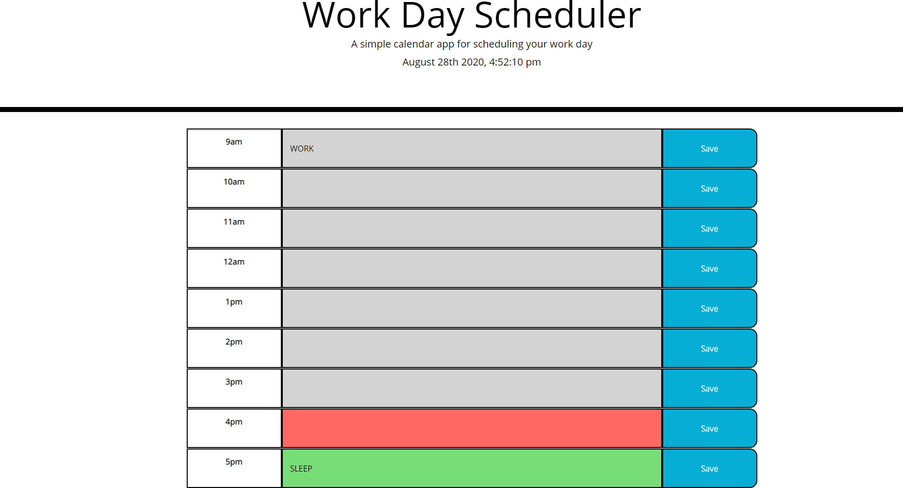

# Quiz
*Quick Links*
- [Description](#Description)
- [Usage](#Usage)
- [Authors](#Authors)
- [Visual](#Visual1)

## Description
A work day scheduler with present/past colored time blocks, and options to save data

## Usage
To keep track of your schedule during a typical 9-5 work day
## Authors
Henry Parrish

## Visual

